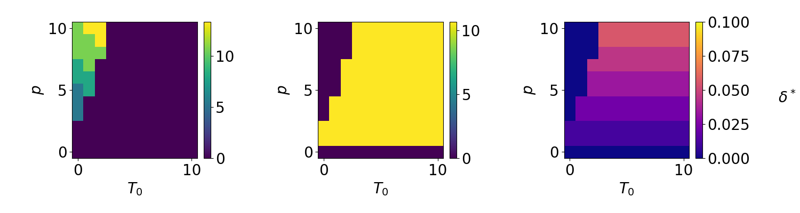

# Summary on 3 state simulations
## "Method"
I originally computed the optimal parameters as in the two state case, that is by analytically computing the average time it would take to consume all the nutrients ($T_S$).
However, to isolate $T_S$ I had to make an assumption that I did not trust on close inspection.
Now I have redone the calculations, and computed the optimal parameters without the previous assumption, but instead by numerically determining $T_S$.
For a given set of antibiotic parameters (p, $T_0$, $T_{ab}$) I determine $T_S$ for every set of bacterial parameters ($\lambda_d$, $\lambda_r$, $\delta$).
The optimal combination of ($\lambda_d$, $\lambda_r$, $\delta$) is the one that minimizes $T_S$.

In addition to the theoretical optimal parameters, I have also computed the competition average parameters.
This is done by evolving several species according to the differential equations and using a solver to find $T_S$ for 20 000 consecutive cycles. The different species have parameters $\lambda_{d/r} \in [0.01, T]$ with $d\lambda = 1$ and $\delta \in [0, 0.05]$ with $d\delta = 0.001$.

The mutation simulations are done like the competition simulations, but with a mutation rate between the different species. Every simulation is started from a single species with a specific set of bacterial parameters (min and max?)

- What about mutation from $\lambda_d$=0? Create exception?
- Extinction?

## Coupled nutrients and antibiotics, $T_0 = 0$

I still get same result as before: optimal strategy is either only triggered persistence, or only spontaneous persistence (see Fig. 1). The result is confirmed by a competition simulation in Fig. 2, where the dashed lines represent the theoretical optimals from Fig. 1.
For $p > 0.1$ the optimal is to have only triggered persistence, whereas for $p=0.1$ spontaneous persistence is the optimal.
$p=0.3$ is very close to the phase transition, and is therefore fluctuating slightly between the two optimals.

For $\lambda_d$ the competition average is not perfectly consistent with the theoretical optimal, which I think is because the resolution of the parameters in Fig. 1 is much higher (The competition average is much more computationally heavy to compute).
The behaviour of $\delta$ for $p=0.3$ is a bit weird.
What I think happens is that when this weakly bistable system jumps from a low risk state (only spontaneous persistence) to a high risk state (only triggered persistence), it also benefits from the marginal additional protection from having $\delta = \delta_{max} = 0.05$.
With time $\delta$ decreases toward 0, but since $\lambda_r = 0.01$ the penalty for having non-zero $\delta$ is very small, hence the decrease is very slow.
The parameter combination of $\lambda_r \approx 0$ and $\delta > 0$ is probably not very realistic.

The last odd feature of the plot is for $p=0.1$.
Whereas $\lambda_r$ and $\delta$ fluctuate a lot, $\lambda_d$ is not.

[comment]: <> ()

## Decoupled nutrients and antibiotics, $T_0 > 0$

Also when the antibiotics are decoupled from the addition of nutrients the two strategies are separated.

## Mutation
Redo competition simulations with mutation.

### To do
3) Modify to add mutation
4) Run mutation

weird delta values for p=0.3, because it doesn't matter what delta is as long as lambda=0?
But why suddenly more fluctuations than earlier??

