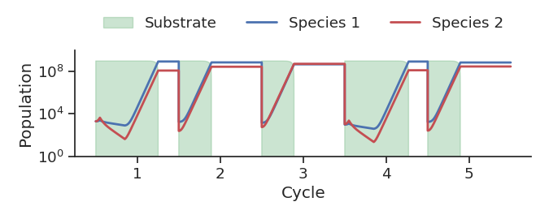

# BacterialPersistence

Code and data for the paper **"Triggered and Spontaneous Dormancy in Bacteria During Feast-Famine Cycles with Stochastic Antibiotic Application"** on bacterial survival strategies in environments with stochastic antibiotics.  
This repository contains Python implementations of two mathematical models of bacterial growth and persistence.

- **2-state model**: Bacteria switch between two phenotypic states.
- **3-state model**: Bacteria switch between three phenotypic states.

## Repository structure

The repository is organized into two main folders:

- `2-state_model/`  
  Code, data, and supplementary scripts for the two-state persistence model.

- `3-state_model/`  
  Code, data, and supplementary scripts for the three-state persistence model.

Each model directory typically contains:

- `src/` – Core model and simulation code.
- `data/` – Generated simulation data.
- `supplementary/` – Additional scripts used for analyses and plotting.
- `check_analytical_calculation/` – Scripts to verify analytical results.
